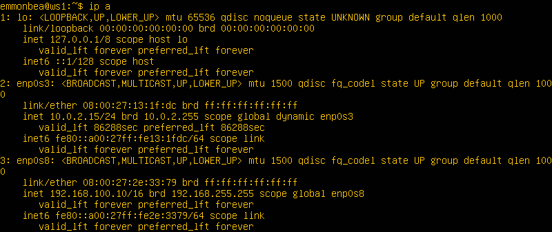
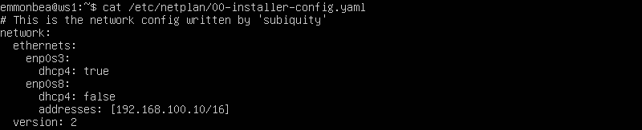

# Сети в Linux

## Содержание

1. [Part 1. Инструмент ipcalc](#part-1-инструмент-ipcalc)
2. [Part 2. Статическая маршрутизация между двумя машинами](#part-2-статическая-маршрутизация-между-двумя-машинами)
3. [Part 3. Утилита iperf3](#part-3-утилита-iperf3)
4. [Part 4. Сетевой экран](#part-4-сетевой-экран)
5. [Part 5. Статическая маршрутизация сети](#part-5-статическая-маршрутизация-сети)
6. [Part 6. Динамическая настройка IP с помощью DHCP](#part-6-динамическая-настройка-ip-с-помощью-dhcp)
7. [Part 7. NAT](#part-7-nat)
8. [Part 8. Дополнительно. Знакомство с SSH Tunnels](#part-8-дополнительно-знакомство-с-ssh-tunnels)

## Part 1. Инструмент ipcalc

Скачать утилиту **ipcalc**: `sudo apt install ipcalc` 
1. Сети и маски. 
    Определить и записать в отчет: 
    1. адрес сети **192.167.38.54/13**: 
        * `ipcalc 192.167.38.54/13` 
         
        **Адрес сети**: 192.160.0.0/13  

    2. перевод маски **255.255.255.0** в префиксную и двоичную запись, **/15** в обычную и двоичную, **11111111.11111111.11111111.11110000** в обычную и префиксную: 
        1. перевод маски **255.255.255.0** в префиксную и двоичную запись: 
            * `ipcalc 255.255.255.0` 
             
            **Префисная запись**: 24 
            **Двоичная запись**: 11111111.11111111.11111111.00000000 
        2. перевод **/15** в обычную и двоичную запись: 
            * `ipcalc /15` 
             
            **Обычная запись**: 255.254.0.0 
            **Двоичная запись**: 11111111.11111111.00000000.00000000 
        3. перевод **11111111.11111111.11111111.11110000** в обычную и префиксную:: 
            * `ipcalc /28` 
             
            **Обычная запись**: 255.255.255.240 
            **Префиксная запись**: 28 
    3. минимальный и максимальный хост в сети **12.167.38.4** при масках: **/8**, **11111111.11111111.00000000.00000000**, **255.255.254.0** и **/4** 
        1. минимальный и максимальный хост в сети **12.167.38.4/8** 
            * `ipcalc 12.167.38.4/8` 
             
            **минимальный хост**: 12.0.0.0/8 
            **максимальный хост**: 12.255.255.254 
        2. минимальный и максимальный хост в сети **12.167.38.4/16** (маска 11111111.11111111.00000000.00000000) 
            * `ipcalc 12.167.38.4/16` 
             
            **минимальный хост**: 12.167.0.1 
            **максимальный хост**: 12.167.255.254 
        3. минимальный и максимальный хост в сети **12.167.38.4/23** (маска 255.255.254.0) 
            * `ipcalc 12.167.38.4/23` 
             
            **минимальный хост**: 12.167.38.1 
            **максимальный хост**: 12.167.39.254 
        4. минимальный и максимальный хост в сети **12.167.38.4/4** 
            * `ipcalc 12.167.38.4/4` 
             
            **минимальный хост**: 0.0.0.1 
            **максимальный хост**: 15.255.255.254 

2. localhost. 
    Определить и записать в отчёт, можно ли обратиться к приложению, работающему на localhost, со следующими IP: **194.34.23.100**, **127.0.0.2**, **127.1.0.1**, **128.0.0.1**: 
    * Адрес **127.0.0.0** – **127.255.255.255** (loopback – петля на себя).   Данная сеть нужна для диагностики, соответственно, мы можем обратиться к приложению, работающему на этом хосте 
    Остальные IP-адреса зарезервированы для частых (локальных) сетей 
     
3. Диапазоны и сегменты сетей 
    Определить и записать в отчёт: 
    1. какие из перечисленных IP можно использовать в качестве публичного, а какие только в качестве частных: **10.0.0.45**, **134.43.0.2**, **192.168.4.2**, **172.20.250.4**, **172.0.2.1**, **192.172.0.1**, **172.68.0.2**, **172.16.255.255**, **10.10.10.10**, **192.169.168.1** 
        1. Публичные IP-адреса: 
            * 134.43.0.2 
            * 172.0.2.1 
            * 192.172.0.1 
            * 172.68.0.2 
            * 192.169.168.1 
        2. Частные IP-адреса: 
            * 10.0.0.45 
            * 192.168.4.2 
            * 172.20.250.4 
            * 10.10.10.10 
    2. какие из перечисленных IP адресов шлюза возможны у сети **10.10.0.0/18**: **10.0.0.1**, **10.10.0.2**, **10.10.10.10**, **10.10.100.1**, **10.10.1.255** 
         
        * Исходя из HostMin: **10.10.0.1** и HostMax: **10.10.63.254** возможные IP шлюзы: **10.10.0.2**, **10.10.10.10**, **10.10.1.255** 

## Part 2. Статическая маршрутизация между двумя машинами

P.S. Во избежание проблем с заданием  необходимо настроить VirtualBox: Добавить на машинах сетевой адаптер 2 (сетевой мост). 

Поднять две виртуальные машины (далее -- **ws1** и **ws2**). 

С помощью команды `ip a` посмотреть существующие сетевые интерфейсы 

* В отчёт поместить скрин с вызовом и выводом использованной команды 
 
 

Описать сетевой интерфейс, соответствующий внутренней сети, на обеих машинах и задать следующие адреса и маски: ws1 - **192.168.100.10**, маска **/16**, ws2 - **172.24.116.8**, маска **/12** 

* В отчёт поместить скрины с содержанием изменённого файла **etc/netplan/00-installer-config.yaml** для каждой машины. 
 
 

Выполнить команду `netplan apply` для перезапуска сервиса сети 

* В отчёт поместить скрин с вызовом и выводом использованной команды. 
 
 
---
1. Добавление статического маршрута вручную 

    1. Добавить статический маршрут от одной машины до другой и обратно при помощи команды вида `ip r add` 
     
     

    2. Пропинговать соединение между машинами 
     
     

2. Добавление статического маршрута с сохранением 

    Перезапустить машины: 
    `reboot` 
    1. Добавить статический маршрут от одной машины до другой с помощью файла **etc/netplan/00-installer-config.yaml**: 
     
     

    2. Пропинговать соединение между машинами: 
    Выполнить команду `sudo netplan apply`. 
     
     

## Part 3. Утилита iperf3

1. Скорость соединения: 
    * Перевести и записать в отчёт: **8 Mbps** в **MB/s****, **100 MB/s** в **Kbps**, **1 Gbps** в **Mbps** 
        * 8 Mbps = 1 MB/s; 
        * 100 MB/s = 800000 Kbps; 
        * 1 Gbps = 1000 Mbps; 
    
2. Утилита iperf3: 
    * Измерить скорость соединения между ws1 и ws2: 
         
         

## Part 4. Сетевой экран

1. Утилита iptables. 
    * Создать файл **/etc/firewall.sh**, имитирующий фаерволл, на ws1 и ws2: 
    `vim /etc/firewall.sh` 
    * Нужно добавить в файл подряд следующие правила: 
        1. на ws1 применить стратегию когда в начале пишется запрещающее правило, а в конце пишется разрешающее правило (это касается пунктов 4 и 5); 
        2. на ws2 применить стратегию когда в начале пишется разрешающее правило, а в конце пишется запрещающее правило (это касается пунктов 4 и 5); 
        3. открыть на машинах доступ для порта 22 (ssh) и порта 80 (http); 
        4. запретить echo reply (машина не должна "пинговаться”, т.е. должна быть блокировка на OUTPUT); 
        5. разрешить echo reply (машина должна "пинговаться"); 

    * В отчёт поместить скрины с содержанием файла /etc/firewall для каждой машины: 
         
         
        Пояснение каждой команде: 
        `iptables -F`: очищает все существующие правила в настройках брандмауэра iptables. Это позволяет сбросить настройки брандмауэра до значений по умолчанию; 
        `iptables -X`: используется для удаления (или очистки) всех пользовательских цепочек в конфигурации файрвола iptables; 
        `iptables -A INPUT -p tcp --dport 22(80) -j ACCEPT`: эта команда добавляет правило в цепь INPUT (входящий трафик), разрешая входящие TCP-соединения на порту 22 (SSH) с помощью флага -j ACCEPT; 
        `iptables -A OUTPUT -p icmp --icmp-type echo-reply -j DROP`:
        эта команда используется для блокировки ответов на пинг. Добавляется правило в ветвь OUTPUT, которое блокирует отправку ICMP-пакетов типа echo-reply (ответ на пинг); 
        `iptables -A OUTPUT -p icmp --icmp-type echo-reply -j ACCEPT`: эта команда добавляет правило в цепь OUTPUT, разрешая отправку исходящих ICMP-пакетов типа echo-reply (ответ на пинг); 
        `/sbin/iptables-save`: эта команда сохраняет текущую конфигурацию брандмауэра iptables, чтобы она смогла пережить перезагрузку системы; 

    * Запустить файлы на обеих машинах командами `chmod +x /etc/firewall.sh` и `/etc/firewall.sh` 

        1. В отчёт поместить скрины с запуском обоих файлов: 
             
             
        2. В отчёте описать разницу между стратегиями, применёнными в первом и втором файлах: 
            * Разница между стратегиями, применяемыми в файлах ws1 и ws2, заключается в порядке применения разрешающих и запрещающих правил. В ws1 сначала устанавливается запрещающее правило, а затем следуют разрешающее. Это означает, что все входящие пакеты будут отброшены, кроме тех, которые соответствуют разрешительным правилам (SSH, HTTP, ICMP). В ws2 происходит наоборот — сначала задается разрешающее правило, а уже потом запрещающее. Это означает, что будут приняты все входящие пакеты, кроме тех, которые соответствуют запрещающим правилам (SSH, HTTP, ICMP). Таким образом, машина ws1 не будет пинговаться, а ws2 пингуется. 
            
2. Утилита **nmap**. 

    Командой ping найти машину, которая не "пингуется", после чего утилитой nmap показать, что хост машины запущен (Проверка: в выводе nmap должно быть сказано: Host is up); 
     
     
     

## Part 5. Статическая маршрутизация сети

Сеть: 
 

Поднять пять виртуальных машин (3 рабочие станции (**ws11**, **ws21**, **ws22**) и 2 роутера (**r1**, **r2**)) 

1. Настройка адресов машин: 
    Настроить конфигурации машин в **etc/netplan/00-installer-config.yaml** согласно сети на рисунке. 
    * В настройках машин в VirtualBox поменять настройки сети: 
        1.  Для ws11, ws21, ws22:
            * Адаптер 1: NAT; 
            * Адаптер 2: Внутренняя сеть; 
        2. Для r1, r2:
            * Адаптер 1: NAT; 
            * Адаптер 2: Внутренняя сеть; 
            * Адаптер 3: Внутренняя сеть; 
    * В отчёт поместить скрины с содержанием файла etc/netplan/00-installer-config.yaml для каждой машины: 
        1. ws11: 
         
        2. ws21: 
         
        3. ws22: 
         
        4. r1: 
         
        5. r2: 
         

    Перезапустить сервис сети. Если ошибок нет, то командой `ip -4 a` проверить, что адрес машины задан верно. 
    * В отчёт поместить скрины с вызовом и выводом использованных команд: 
        1. ws11: 
         
        2. ws21: 
         
        3. ws22: 
         
        4. r1: 
         
        5. r2: 
         

    Также пропинговать ws22 с ws21. Аналогично пропинговать r1 с ws11. 
    1. ws22 с ws21: 
     
    2. r1 с ws11: 
     

2. Включение переадресации IP-адресов: 
    Для включения переадресации IP, выполните команду на роутерах: 
    `sysctl -w net.ipv4.ip_forward=1` 
    При таком подходе переадресация не будет работать после перезагрузки системы.
    * В отчёт поместить скрин с вызовом и выводом использованной команды: 
        1. r1: 
         
        2. r2: 
         

    Откройте файл **/etc/sysctl.conf**  и добавьте в него следующую строку: 
    `net.ipv4.ip_forward = 1` 
    При использовании этого подхода, IP-переадресация включена на постоянной основе. 
    * В отчёт поместить скрин с содержанием изменённого файла /etc/sysctl.conf: 
     

3. Установка маршрута по-умолчанию: 
    Настроить маршрут по-умолчанию (шлюз) для рабочих станций. Для этого добавить default перед IP роутера в файле конфигураций 
    * В отчёт поместить скрин с содержанием файла **etc/netplan/00-installer-config.yaml**:
        1. ws11: 
         
        2. ws21: 
         
        3. ws22: 
         

    Принять изменения: `sudo netplan apply`; 
    Вызвать `ip r` и показать, что добавился маршрут в таблицу маршрутизации: 
    * В отчёт поместить скрин с вызовом и выводом использованной команды: 
        1. ws11: 
         
        2. ws21: 
         
        3. ws22: 
         

    Пропинговать с **ws11** роутер **r2** и показать на **r2**, что пинг доходит. Для этого использовать команду: `tcpdump -tn -i eth1` 
    * В отчёт поместить скрин с вызовом и выводом использованных команд.
        1. пропинговать с **ws11** роутер **r2** 
         
        2. показать на **r2**, что пинг доходит 
         

4. Добавление статических маршрутов 
    Добавить в роутеры r1 и r2 статические маршруты в файле конфигураций: 
    * В отчёт поместить скрины с содержанием изменённого файла **etc/netplan/00-installer-config.yaml** для каждого роутера: 
        1. r1: 
         
        2. r2: 
         

    Вызвать ip r и показать таблицы с маршрутами на обоих роутерах:
    * В отчёт поместить скрин с вызовом и выводом использованной команды: 
        1. r1: 
         
        2. r2: 
         

    Запустить команды на ws11: 
    `ip r list 10.10.0.0/[маска сети]` и `ip r list 0.0.0.0/0` 
    * В отчёт поместить скрин с вызовом и выводом использованных команд:
     
    * В отчёте объяснить, почему для адреса 10.10.0.0/[маска сети] был выбран маршрут, отличный от 0.0.0.0/0, хотя он попадает под маршрут по-умолчанию: 
        * Для адреса 10.10.0.0/18 был выбран маршрут, отличный от 0.0.0.0/0, потому что 0.0.0.0/0 будет выбран в том случае, когда другой маршрут не задан в таблице маршрутизации хоста. ws11 находится внутри сети 10.10.0.0/18, и для связи с ней используется IP-адрес 10.10.0.2, поэтому ws11 отправляет данные на роутер, используя маршрут по умолчанию. 
    
    5. Построение списка маршрутизаторов: 
        1.  Запустить на **r1** команду дампа: 
        `tcpdump -tnv -i eth0` 
        2. При помощи утилиты traceroute построить список маршрутизаторов на пути от ws11 до ws21 
            * В отчёт поместить скрины с вызовом и выводом использованных команд (tcpdump и traceroute): 
             
            * В отчёте, опираясь на вывод, полученный из дампа на r1, объяснить принцип работы построения пути при помощи traceroute: 
                * Из дампа на r1 видно, что пакет проходит через маршрутизаторы для достижения указанного адреса. На этом основан принцип работы traceroute 
                * Каждый пакет проходит на своем пути определенное количество узлов, пока достигнет своей цели. Причем, каждый пакет имеет свое время жизни. Это количество узлов, которые может пройти пакет перед тем, как он будет уничтожен. Этот параметр записывается в заголовке TTL, каждый маршрутизатор, через который будет проходить пакет уменьшает его на единицу. При TTL=0 пакет уничтожается, а отправителю отсылается сообщение Time Exceeded. 
                * Команда traceroute linux использует UDP пакеты. Она отправляет пакет с TTL=1 и смотрит адрес ответившего узла, дальше TTL=2, TTL=3 и так пока не достигнет цели. Каждый раз отправляется по три пакета и для каждого из них измеряется время прохождения. Пакет отправляется на случайный порт, который, скорее всего, не занят. Когда утилита traceroute получает сообщение от целевого узла о том, что порт недоступен трассировка считается завершенной. 

    6. Использование протокола ICMP при маршрутизации: 
        > **ICMP** (англ. Internet Control Message Protocol — протокол межсетевых управляющих сообщений[1]) — сетевой протокол, входящий в стек протоколов TCP/IP. В основном ICMP используется для передачи сообщений об ошибках и других исключительных ситуациях, возникших при передаче данных 
        1. Запустить на r1 перехват сетевого трафика, проходящего через eth0 с помощью команды: 
            * `tcpdump -n -i eth0 icmp`
        2. Пропинговать с ws11 несуществующий IP (например, 10.30.0.111) с помощью команды: 
            * `ping -c 1 10.30.0.111` 
             
             

## Part 6. Динамическая настройка IP с помощью DHCP

## Part 7. NAT

## Part 8. Дополнительно. Знакомство с SSH Tunnels

