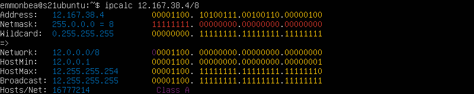

# Сети в Linux

## Содержание

1. [Part 1. Инструмент ipcalc](#part-1-инструмент-ipcalc)
2. [Part 2. Статическая маршрутизация между двумя машинами](#part-2-статическая-маршрутизация-между-двумя-машинами)
3. [Part 3. Утилита iperf3](#part-3-утилита-iperf3)
4. [Part 4. Сетевой экран](#part-4-сетевой-экран)
5. [Part 5. Статическая маршрутизация сети](#part-5-статическая-маршрутизация-сети)
6. [Part 6. Динамическая настройка IP с помощью DHCP](#part-6-динамическая-настройка-ip-с-помощью-dhcp)
7. [Part 7. NAT](#part-7-nat)
8. [Part 8. Дополнительно. Знакомство с SSH Tunnels](#part-8-дополнительно-знакомство-с-ssh-tunnels)

## Part 1. Инструмент ipcalc

Скачать утилиту **ipcalc**: `sudo apt install ipcalc` 
1. Сети и маски. 
    Определить и записать в отчет: 
    1. адрес сети **192.167.38.54/13**: 
        * `ipcalc 192.167.38.54/13` 
         
        **Адрес сети**: 192.160.0.0/13  

    2. перевод маски **255.255.255.0** в префиксную и двоичную запись, **/15** в обычную и двоичную, **11111111.11111111.11111111.11110000** в обычную и префиксную: 
        1. перевод маски **255.255.255.0** в префиксную и двоичную запись: 
            * `ipcalc 255.255.255.0` 
             
            **Префисная запись**: 24 
            **Двоичная запись**: 11111111.11111111.11111111.00000000 
        2. перевод **/15** в обычную и двоичную запись: 
            * `ipcalc /15` 
             
            **Обычная запись**: 255.254.0.0 
            **Двоичная запись**: 11111111.11111111.00000000.00000000 
        3. перевод **11111111.11111111.11111111.11110000** в обычную и префиксную:: 
            * `ipcalc /28` 
             
            **Обычная запись**: 255.255.255.240 
            **Префиксная запись**: 28 
    3. минимальный и максимальный хост в сети **12.167.38.4** при масках: **/8**, **11111111.11111111.00000000.00000000**, **255.255.254.0** и **/4** 
        1. минимальный и максимальный хост в сети **12.167.38.4/8** 
            * `ipcalc 12.167.38.4/8` 
             
            **минимальный хост**: 12.0.0.0/8 
            **максимальный хост**: 12.255.255.254 
        2. минимальный и максимальный хост в сети **12.167.38.4/16** (маска 11111111.11111111.00000000.00000000) 
            * `ipcalc 12.167.38.4/16` 
             
            **минимальный хост**: 12.167.0.1 
            **максимальный хост**: 12.167.255.254 
        3. минимальный и максимальный хост в сети **12.167.38.4/23** (маска 255.255.254.0) 
            * `ipcalc 12.167.38.4/23` 
             
            **минимальный хост**: 12.167.38.1 
            **максимальный хост**: 12.167.39.254 
        4. минимальный и максимальный хост в сети **12.167.38.4/4** 
            * `ipcalc 12.167.38.4/4` 
             
            **минимальный хост**: 0.0.0.1 
            **максимальный хост**: 15.255.255.254 

2. localhost. 
    Определить и записать в отчёт, можно ли обратиться к приложению, работающему на localhost, со следующими IP: **194.34.23.100**, **127.0.0.2**, **127.1.0.1**, **128.0.0.1**: 
    * Адрес **127.0.0.0** – **127.255.255.255** (loopback – петля на себя).   Данная сеть нужна для диагностики, соответственно, мы можем обратиться к приложению, работающему на этом хосте 
    Остальные IP-адреса зарезервированы для частых (локальных) сетей 
     
3. Диапазоны и сегменты сетей 
    Определить и записать в отчёт: 
    1. какие из перечисленных IP можно использовать в качестве публичного, а какие только в качестве частных: **10.0.0.45**, **134.43.0.2**, **192.168.4.2**, **172.20.250.4**, **172.0.2.1**, **192.172.0.1**, **172.68.0.2**, **172.16.255.255**, **10.10.10.10**, **192.169.168.1** 
        1. Публичные IP-адреса: 
            * 134.43.0.2 
            * 172.0.2.1 
            * 192.172.0.1 
            * 172.68.0.2 
            * 192.169.168.1 
        2. Частные IP-адреса: 
            * 10.0.0.45 
            * 192.168.4.2 
            * 172.20.250.4 
            * 10.10.10.10 
    2. какие из перечисленных IP адресов шлюза возможны у сети **10.10.0.0/18**: **10.0.0.1**, **10.10.0.2**, **10.10.10.10**, **10.10.100.1**, **10.10.1.255** 
         
        * Исходя из HostMin: **10.10.0.1** и HostMax: **10.10.63.254** возможные IP шлюзы: **10.10.0.2**, **10.10.10.10**, **10.10.1.255** 

## Part 2. Статическая маршрутизация между двумя машинами

P.S. Во избежание проблем с заданием  необходимо настроить VirtualBox: Добавить на машинах сетевой адаптер 2 (сетевой мост). 

Поднять две виртуальные машины (далее -- **ws1** и **ws2**). 

С помощью команды `ip a` посмотреть существующие сетевые интерфейсы 

* В отчёт поместить скрин с вызовом и выводом использованной команды 
 
 

Описать сетевой интерфейс, соответствующий внутренней сети, на обеих машинах и задать следующие адреса и маски: ws1 - **192.168.100.10**, маска **/16**, ws2 - **172.24.116.8**, маска **/12** 

* В отчёт поместить скрины с содержанием изменённого файла **etc/netplan/00-installer-config.yaml** для каждой машины. 
 
 

Выполнить команду `netplan apply` для перезапуска сервиса сети 

* В отчёт поместить скрин с вызовом и выводом использованной команды. 
 
 
---
1. Добавление статического маршрута вручную 

    1. Добавить статический маршрут от одной машины до другой и обратно при помощи команды вида `ip r add` 
     
     

    2. Пропинговать соединение между машинами 
     
     

2. Добавление статического маршрута с сохранением 

    Перезапустить машины: 
    `reboot` 
    1. Добавить статический маршрут от одной машины до другой с помощью файла **etc/netplan/00-installer-config.yaml**: 
     
     

    2. Пропинговать соединение между машинами: 
    Выполнить команду `sudo netplan apply`. 
     
     

## Part 3. Утилита iperf3

## Part 4. Сетевой экран

## Part 5. Статическая маршрутизация сети

## Part 6. Динамическая настройка IP с помощью DHCP

## Part 7. NAT

## Part 8. Дополнительно. Знакомство с SSH Tunnels

